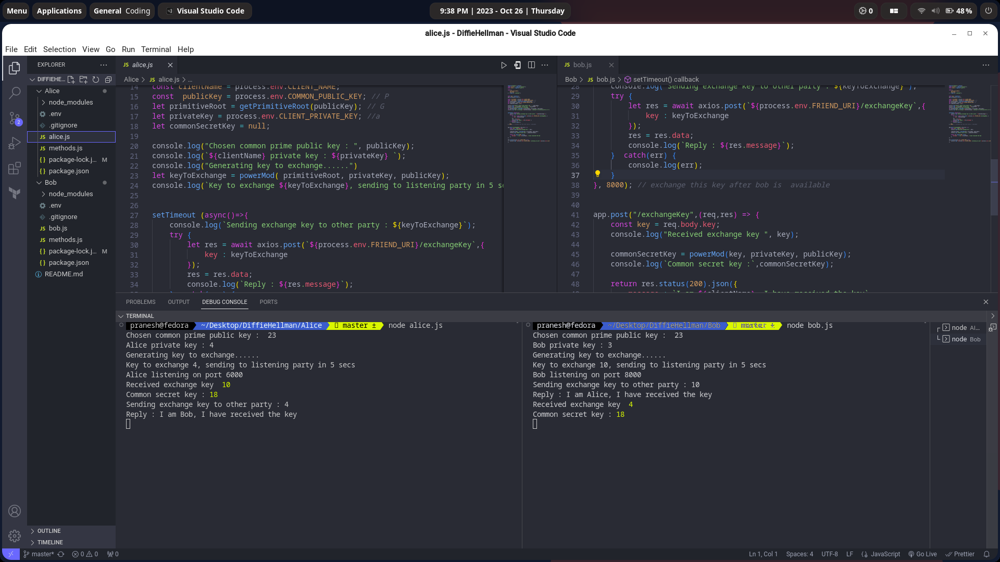

 Clone the repo

  ```bash 
  git clone https://github.com/Cryptography-demo-in-NodeJs/DiffieHellman.git
  ```
 Open 2 terminals one for Alice one for Bob

  ```bash 
  cd Alice
  npm i 
  ```

  ```bash
  cd Bob 
  npm i 
  ```
Start the servers bob first

  ```bash 
  node bob.js
  ```

  ```bash
  node alice.js
  ```

Demo


